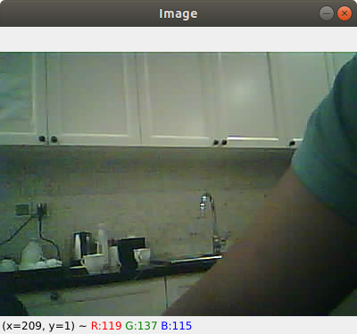
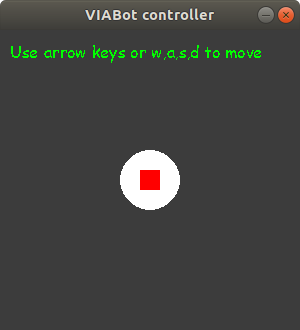
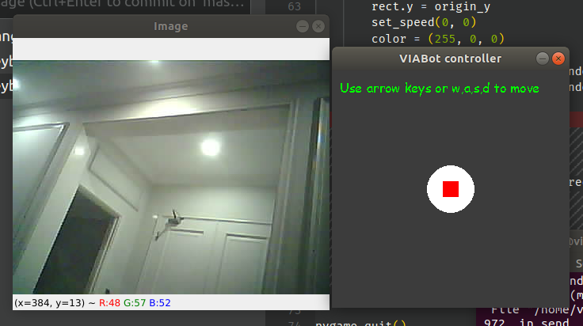
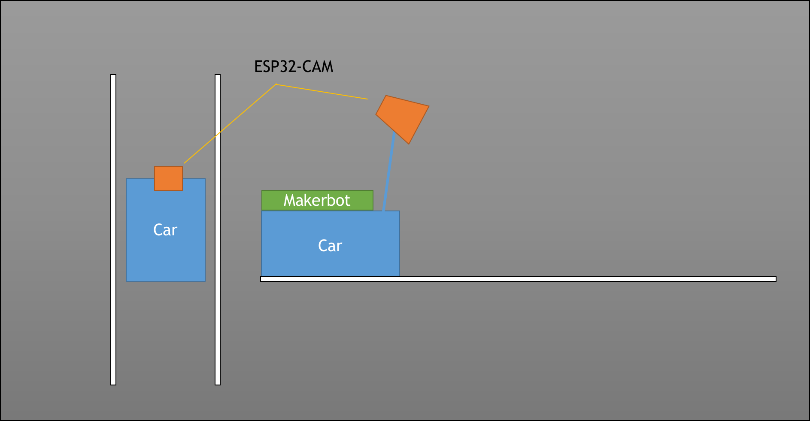
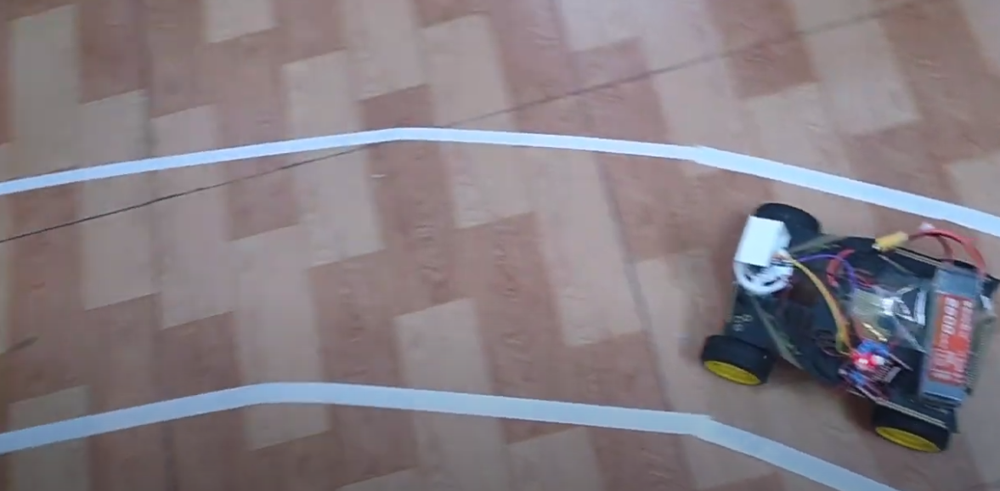
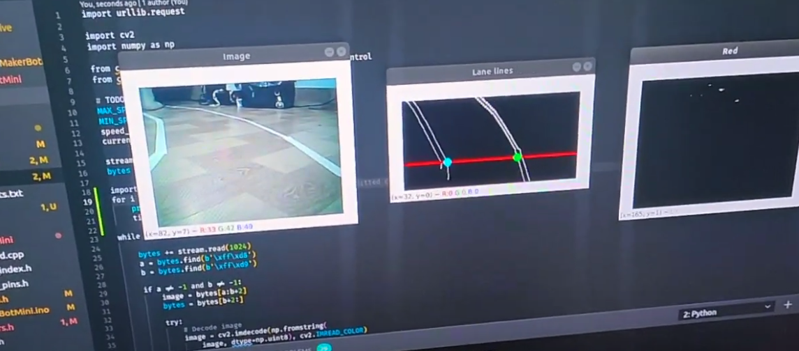

# MakerBot Mini 2022
## I. Nạp firmware và kiểm tra phần cứng

### 1. Thiết kế phần cứng

Để chạy được các ví dụ demo, các bạn cần có các linh kiện phần cứng sau:

- Module ESP32-CAM.
- Mạch MakerbotMini để điều khiển động cơ.
- Khung xe robot tròn hoặc một khung xe tương đương có lắp động cơ 5V.
- Các linh kiện khác: Pin, sạc, dây nối.

**Thông tin kết nối WIFI của mạch ESP32-Cam**

- SSID: `MBotMini-<ID>`, trong đó ID là mã phần cứng của ESP32-Cam.
- Mật khẩu: `makerbotisfun`

Các bạn có thể thay đổi thông tin này bằng cách sửa code và nạp lại firmware.

### 2. Nạp firmware

Trước tiên, chúng ta cần nạp firmware cho mạch Makerbot và module ESP32-CAM.

**Nạp firmware với PlatformIO:** Chúng tôi khuyến khích sử dụng PlatformIO cài đặt trên Visual Studio Code để thực hiện nạp firmware. Sau đó, các bạn có thể nạp firmware bằng cách dùng PlatformIO mở các folder sau, biên dịch và nạp code lên các mạch. Hướng dẫn cài đặt và sử dụng PlatformIO để nạp firmware các bạn có thể truy cập tại [đây](docs/Guide-PlatformIO-Windows.pdf).

Các bạn cần cài đặt thêm Driver CH340 khi sử dụng với Windows theo hướng dẫn tại đây: <https://www.arduined.eu/ch340-windows-10-driver-download/>.

Mở thư mục [./firmware](./firmware) bằng Visual Studio Code và thực hiện nạp firmware theo hướng dẫn trên. Cấu hình cho firmware có thể xem tại: [firmware/src/config.h](firmware/src/config.h).

**Hiên tại mã nguồn firmware chưa hỗ trợ Arduino IDE**

### 3. Kiểm tra tín hiệu hình ảnh từ ESP32-CAM

Kết nối vào WIFI `MBotMini-<ID>` và mở trình duyệt web, truy cập: [http://192.168.4.1](http://192.168.4.1) để xem hình ảnh thu được từ camera.

**Đọc camera từ ESP32-CAM bằng Python:**

Để đọc camera từ Python, máy tính của các bạn cần được cài đặt Python và package OpenCV. Trước tiên hãy cài đặt Python với trình quản lý gói Pip, sau đó dùng Pip để cài OpenCV: `pip install opencv-python`. Chúng tôi khuyến khích các bạn tìm hiểu về [Anaconda](https://www.anaconda.com/) / [Miniconda](https://docs.conda.io/en/latest/miniconda.html) để quản lý môi trường cho Python.

Chạy code đọc camera từ ESP32: Các bạn kết nối vào WIFI của mạch ESP32-CAM, sau đó chạy chương trình tại [client/read_esp32_cam/read_cam.py](client/read_esp32_cam/read_cam.py).

```
cd client/read_esp32_cam/
pip install -r requirements.txt
python read_cam.py
```



**Hình ảnh thu được từ camera ESP32-CAM**

### 4. Ví dụ về điều khiển bằng bàn phím


Cài đặt môi trường Python từ tệp `client/keyboard_control/requirements.txt` bằng cách gõ `pip install -r requirements.txt`.

Chạy ví dụ điều khiển bằng bàn phím cho VIABot:

```
cd client/keyboard_control/
pip install -r requirements.txt
python keyboard_control.py
```



Một cửa sổ điều khiển hiện lên như trên. Dùng các phím mũi tên để thử điều khiển các motor của VIABot.

**Điều khiển kết hợp xem camera từ mạch ESP32-Cam:**

```
cd client/keyboard_control/
pip install -r requirements.txt
python keyboard_control_with_cam.py
```




### 5. Ví dụ về điều khiển xe tự lái đi theo vạch kẻ đường

Dán vạch kẻ đường cho VIABot như hình:





Mở terminal trong folder `client/auto_drive` và chạy ví dụ:

```
python drive.py
```

Các cửa sổ thể hiện sự phân tích hình ảnh sẽ hiện lên khi kết nối thành công với ESP32-CAM.



Chỉnh góc xoay của camera để nhìn thấy vạch kẻ đường. Các bạn nên để camera ở trên cao khoảng 15-20 cm, chúc đầu xuống một chút để đạt góc nhìn tốt nhất. Tiếp đó chỉnh các tham số và thuật toán tính toán trong hàm `calculate_control_signal()` của tệp [client/auto_drive/controller.py](client/auto_drive/controller.py).
