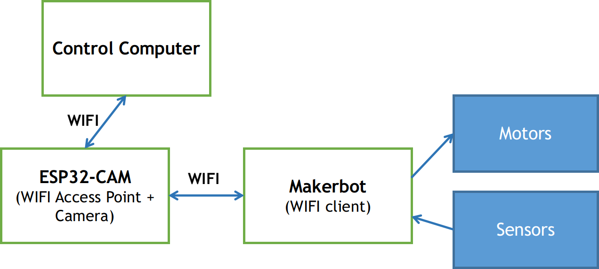

# MakerBot Mini 2022
## I. Nạp firmware và kiểm tra phần cứng

### 1. Thiết kế phần cứng

Để chạy được các ví dụ demo, các bạn cần có các linh kiện phần cứng sau:

- Mạch Makerbot để điều khiển động cơ, đọc cảm biến: <https://via.makerviet.org/vi/docs/hardware/design/>.
- Module ESP32-CAM như một phần mở rộng của mạch Makerbot để đọc camera: <https://bit.ly/3fFHPOe>.
- Khung xe robot tròn hoặc một khung xe tương đương có lắp động cơ 5V: <https://bit.ly/3plS8u8>.
- Các linh kiện khác: Pin, sạc, dây nối.

Ở thiết kế cơ bản, chúng ta sẽ dùng ESP32-CAM để làm bộ phát WIFI. Máy tính điều khiển - Control Computer có thể được kết nối vào WIFI này, nhận hình ảnh từ camera. Thông qua WIFI của mạch ESP32-CAM, máy tính điều khiển cũng có thể kết nối tới mạch Makerbot để đọc các giá trị cảm biến và điều khiển động cơ. Mạch Makerbot sẽ hoạt động như một thiết bị client, bắt WIFI của ESP32-CAM, nhận lệnh từ máy tính truyền xuống và đồng thời truyền lại các giá trị cảm biến mà nó đọc được.



**Thông tin kết nối WIFI của mạch ESP32-Cam**

- SSID: `MBotMini-<ID>`
- Mật khẩu: `makerbotisfun`

Các bạn có thể thay đổi thông tin này bằng cách sửa code và nạp lại firmware.

### 2. Nạp firmware

Trước tiên, chúng ta cần nạp firmware cho mạch Makerbot và module ESP32-CAM.

**Nạp firmware với PlatformIO: Chúng tôi khuyến khích sử dụng PlatformIO cài đặt trên Visual Studio Code để thực hiện nạp firmware. Sau đó, các bạn có thể nạp firmware bằng cách dùng PlatformIO mở các folder sau, biên dịch và nạp code lên các mạch. Hướng dẫn cài đặt và sử dụng PlatformIO để nạp firmware các bạn có thể truy cập tại [đây](docs/Guide-PlatformIO-Windows-VSC2021.pdf).

Các bạn cần cài đặt thêm Driver CH340 khi sử dụng với Windows theo hướng dẫn tại đây: <https://www.arduined.eu/ch340-windows-10-driver-download/>.

- Firmware cho mạch ESP32-CAM: [./src](./src).

**Hiên tại code firmware chưa hỗ trợ Arduino IDE**

### 3. Kiểm tra tín hiệu hình ảnh từ ESP32-CAM

Kết nối vào WIFI `VIA-MakerBot-01` và mở trình duyệt web, truy cập: [http://192.168.4.1](http://192.168.4.1) để xem hình ảnh thu được từ camera.

**Đọc camera từ ESP32-CAM bằng Python:**

Để đọc camera từ Python, máy tính của các bạn cần được cài đặt Python và package OpenCV. Trước tiên hãy cài đặt Python với trình quản lý gói Pip, sau đó dùng Pip để cài OpenCV: `pip install opencv-python`. BTC khuyến khích các bạn tìm hiểu về Anaconda / Miniconda để quản lý môi trường cho Python. Cách cài đặt Anaconda có thể được tìm thấy tại [đây](https://via.makerviet.org/vi/docs/simulation/installation/).

Chạy code đọc camera từ ESP32: Các bạn kết nối vào WIFI của mạch ESP32-CAM, sau đó chạy chương trình tại [examples/read_esp32_cam/read_cam.py](examples/read_esp32_cam/read_cam.py).

```
python read_cam.py
```


**Hình ảnh thu được từ camera ESP32-CAM**

### 4. Ví dụ về điều khiển bằng bàn phím


Cài đặt môi trường Python từ tệp `examples/keyboard_control/requirements.txt` bằng cách gõ `pip install -r requirements.txt`.

Chạy ví dụ điều khiển bằng bàn phím cho VIABot:

```
python keyboard_control.py
```


Một cửa sổ điều khiển hiện lên như trên. Dùng các phím mũi tên để thử điều khiển các motor của VIABot.

**Điều khiển kết hợp xem camera từ mạch ESP32-Cam:**

```
python keyboard_control_with_cam.py
```


### 5. Ví dụ về điều khiển xe tự lái đi theo vạch kẻ đường

Dán vạch kẻ đường cho VIABot như hình:


Mở terminal trong folder `examples/auto_drive` và chạy ví dụ:

```
python drive.py
```

Các cửa sổ thể hiện sự phân tích hình ảnh sẽ hiện lên khi kết nối thành công với ESP32-CAM.


Chỉnh góc xoay của camera để nhìn thấy vạch kẻ đường. Các bạn nên để camera ở trên cao khoảng 15-20 cm, chúc đầu xuống một chút để đạt góc nhìn tốt nhất. Tiếp đó chỉnh các tham số và thuật toán tính toán trong hàm `calculate_control_signal()` của tệp [examples/auto_drive/controller.py](examples/auto_drive/controller.py).
